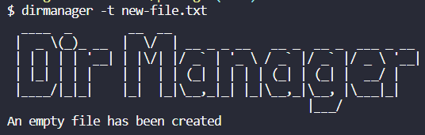

# Dir Manager

DirManager is a CLI (command line interface) application that allows full directory control while improving readibility and ease of use.

## How to install

To install dirmanager, you need the latest version of node.js and npm install on your machine.

Then on the terminal, you can write the following command to install dirmanager:

`npm i dirmanager-ricardopina`

## Valid commands

To get the list of valid commands, you can type `dirmanager` directly on the terminal.

You can also type `dirmanager -h` which stands for _help_. Both commands will yield the main menu:

## List Directory

To list the contents of a directory, you can use one of the following flags. Optionally, you can add an argument to display a specific directory.

`dirmanager -l [optional argument]`

or

`dirmanager -ls [optional argument]`

## Create a directory

To create a directory, you can use one of the following flags followed by the name of the directory:

`dirmanager -m <directory-name>`

or

`dirmanager -mkdir <directory-name>`

## Create a file

To create a file, you can use one of the following flags followed by the name of the file:

`dirmanager -t <file-name>`

or

`dirmanager --touch <file-name>`

## Version

To check the current version of the application, you can use one of the following flags:

`dirmanager -V`

or

`dirmanager --version`

## Help

As referenced before, to find the help page you can use one of the following flags:

`dirmanager -h`

or

`dirmanager --help`

